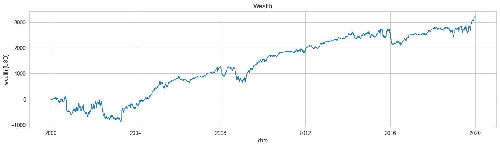
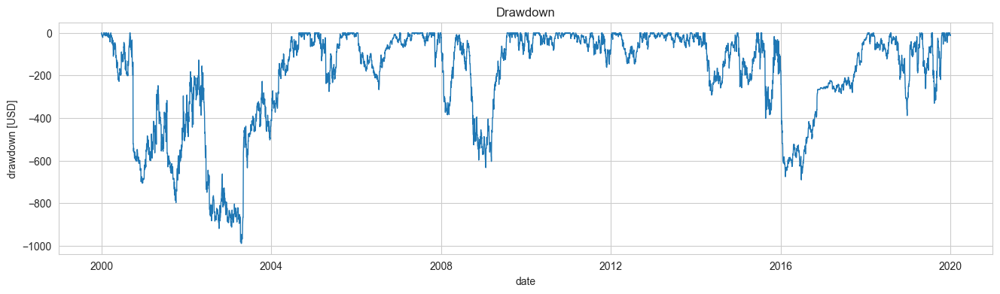
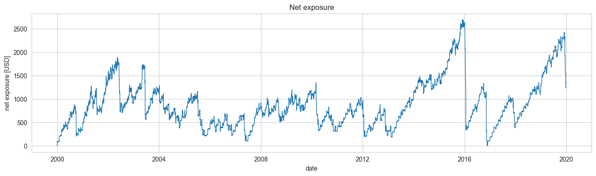

# Epymetheus: Python Library for Multi-asset Backtesting

[](https://pypi.org/project/epymetheus/)
[](https://pypi.org/project/epymetheus/)
[](https://github.com/simaki/epymetheus/actions?query=workflow%3ACI)
[](https://codecov.io/gh/simaki/epymetheus)
[](https://pypi.org/project/epymetheus/)
[](LICENSE)
[](https://github.com/psf/black)



## Introduction

Epymetheus is a Python library for multi-asset backtesting.
It provides an end-to-end framework that lets analysts build and try out their trade strategy right away.

### Features

1. **Simple and Intuitive API**: The API is minimally organized so that you can focus on your idea. Trade `Strategy` can be readily coded and its backtesting is consistently carried out by its methods `run()` and `evaluate()`.
2. **Seamless connection to [Pandas](https://github.com/pandas-dev/pandas)**: You can just put in pandas DataFrame as an input historical data. Backtesting results can be quickly converted to Pandas format so that you can view, analyze and plot results by the familiar Pandas methods.
3. **Extensibility with Other Frameworks**: Epymetheus only provides a framework. Strategy can be readily built with other libraries for machine learning, econometrics, technical indicators, derivative pricing models and so forth.
4. **Efficient Computation**: Backtesting engine is boosted by NumPy. You can give your own idea a quick try.
5. **Full Test Coverage**: Epymetheus is thoroughly tested with 100% test coverage for multiple Python versions.

### Modules

1. **[Strategy](https://github.com/simaki/epymetheus/tree/master/epymetheus/strategy)**: A strategy encodes your own trading rules. The [`benchmarks`](https://github.com/simaki/epymetheus/tree/master/epymetheus/benchmarks) provide standard strategies to be compared with.
2. **[Universe](https://github.com/simaki/epymetheus/tree/master/epymetheus/universe)**: A universe stores historical prices of a set of securities. The [`datasets`](https://github.com/simaki/epymetheus/tree/master/epymetheus/datasets) provide sample universe like Brownian stock prices and blue chips in the US.
3. **[History](https://github.com/simaki/epymetheus/tree/master/epymetheus/history)**: A history stores the assets, lots, profit/loss of each trade yielded. Easily converted into Pandas DataFrame.
4. **[Metric](https://github.com/simaki/epymetheus/tree/master/epymetheus/metric)**: A metric is a function to assess the performance of your strategy. Available metrics include: final wealth, maximum drawdown, Sharpe ratio and so forth.

### Integrations

Strategies may be integrated with:

- **Machine Learning**: [scikit-learn](https://github.com/scikit-learn/scikit-learn), [TensorFlow](https://github.com/tensorflow/tensorflow), [PyTorch](https://github.com/pytorch/pytorch), etc.
- **Econometrics**: [statsmodels](https://github.com/statsmodels/statsmodels), etc.
- **Technical Indicators**: [TA-Lib](https://github.com/mrjbq7/ta-lib), etc.
- **Hyperparameter Optimization**: [optuna](https://github.com/optuna/optuna) ([Example](examples/examples/hypara.py))

### Examples

Example codes are provided [here](https://github.com/simaki/epymetheus/tree/master/examples).

## Installation

```sh
$ pip install epymetheus
```

## How to use

[](https://colab.research.google.com/github/simaki/epymetheus/blob/master/examples/readme/readme.ipynb)

### Create strategy

Let's construct your own strategy.

```python
import epymetheus as ep


def dumb_strategy(universe, profit_take=10.0, stop_loss=-10.0):
    """
    Buy the cheapest stock every month with my allowance.

    Parameters
    ----------
    - profit_take : float, default None
        Threshold (in unit of USD) to make profit-take order.
    - stop_loss : float, default None
        Threshold (in unit of USD) to make stop-loss order.

    Yields
    ------
    trade : ep.trade
        Trade object.
    """
    # I get allowance on the first business day of each month
    allowance = 100.0
    allowance_dates = pd.date_range(
        universe.prices.index[0], universe.prices.index[-1], freq="BMS"
    )

    for date in allowance_dates:
        # Find the cheapest stock
        cheapest_stock = universe.prices.loc[date].idxmin()

        # Find the maximum number of shares that I can buy with my allowance
        n_shares = allowance // universe.prices.at[date, cheapest_stock]

        # Trade!
        trade = n_shares * ep.trade(
            cheapest_stock,
            open_bar=date,
            take=profit_take,
            stop=stop_loss,
        )
        yield trade
```

Here the first parameter `universe` is mandatory and means the target of trading (US stocks, JP stocks, set of cryptocurrencies, etc).
The second parameter, `allowance`, parametrizes your strategy.

Profit-taking ($10) and Stop-loss (-$10).

You can create your strategy with the specific value of `allowance` as follows.

```python
my_strategy = ep.create_strategy(dumb_strategy, allowance=100.0)
```

### Run strategy

Now your strategy can readily be backtested with any `Universe`.

```python
from epymetheus.datasets import fetch_usstocks

universe = fetch_usstocks(n_assets=10)
universe.prices
#                  AAPL        MSFT         AMZN   BRK-A         JPM         JNJ         WMT        BAC          PG        XOM
# 2000-01-01   0.785456   37.162327    76.125000   56100   27.773939   27.289129   46.962898  14.527933   31.304089  21.492596
# 2000-01-02   0.785456   37.162327    76.125000   56100   27.773939   27.289129   46.962898  14.527933   31.304089  21.492596
# 2000-01-03   0.855168   37.102634    89.375000   54800   26.053429   26.978193   45.391777  14.021359   30.625511  20.892334
# 2000-01-04   0.783068   35.849308    81.937500   52000   25.481777   25.990519   43.693306  13.189125   30.036228  20.492161
# 2000-01-05   0.794528   36.227283    69.750000   53200   25.324482   26.264877   42.801613  13.333860   29.464787  21.609318

my_strategy.run(universe)
# Yield 240 trades: trade(['BAC'], lot=[3.], open_bar=2019-12-02 00:00:00) ... Done. (Runtime : 0.12 sec)
# Execute 240 trades: trade(['BAC'], lot=[3.], open_bar=2019-12-02 00:00:00) ... Done. (Runtime : 0.03 sec)
# Done. (Runtime : 0.15 sec)
```

### Trade history and wealth

```python
df_history = my_strategy.history.to_dataframe()
df_history.head()
#           trade_id asset    lot   open_bar  close_bar shut_bar  take  stop          pnl
# order_id
# 0                0  AAPL  116.0 2000-01-03 2019-12-31     None  None  None  8275.172683
# 1                1  AAPL  130.0 2000-02-01 2019-12-31     None  None  None  9285.507999
# 2                2  AAPL  100.0 2000-03-01 2019-12-31     None  None  None  7119.731641
# 3                3  AAPL   98.0 2000-04-03 2019-12-31     None  None  None  6975.090952
# 4                4  AAPL  105.0 2000-05-01 2019-12-31     None  None  None  7480.531225
```

Wealth.

```python
df_wealth = my_strategy.wealth.to_dataframe()
df_wealth.head()
#               wealth
# bars
# 2000-01-01  0.000000
# 2000-01-02  0.000000
# 2000-01-03  0.000000
# 2000-01-04 -8.363557
# 2000-01-05 -7.034265
```


### Scores

You can also quickly `score` metrics of the perfornance.

For example, drawdown, exposure and Sharpe ratio are given by:

```python
from epymetheus.metrics import Drawdown
from epymetheus.metrics import MaxDrawdown
from epymetheus.metrics import SharpeRatio

drawdown = my_strategy.score(Drawdown())
max_drawdown = my_strategy.score(MaxDrawdown())
net_exposure = my_strategy.score(Exposure(net=True))
abs_exposure = my_strategy.score(Exposure(net=False))
sharpe_ratio = my_strategy.score(SharpeRatio())
```




## More examples

### Optimization

(Remember that optimization for backtesting is dangerous.)

```python
import optuna


def objective(trial):
    profit_take = trial.suggest_int("profit_take", 10, 100)
    stop_loss = trial.suggest_int("stop_loss", -100, -10)
    
    my_strategy = ep.create_strategy(
        dumb_strategy,
        profit_take=profit_take,
        stop_loss=stop_loss,
    )
    my_strategy.run(universe, verbose=False)

    return my_strategy.score(FinalWealth())


study = optuna.create_study(direction="maximize")
study.optimize(objective, n_trials=100)

study.best_params
# {'profit_take': 100, 'stop_loss': -83}
```

### Pair trading

```python
def pair_trading(universe, param_1, ...):
    ...
    # Buy 1 share of "BULLISH_STOCK" and sell 2 share of "BULLISH_STOCK".
    # Stop-loss is executed when the total loss exceeds -100.0.
    yield [1.0, -2.0] * ep.trade(["BULLISH_STOCK", "BEARISH_STOCK"], stop=-100.0)
```
